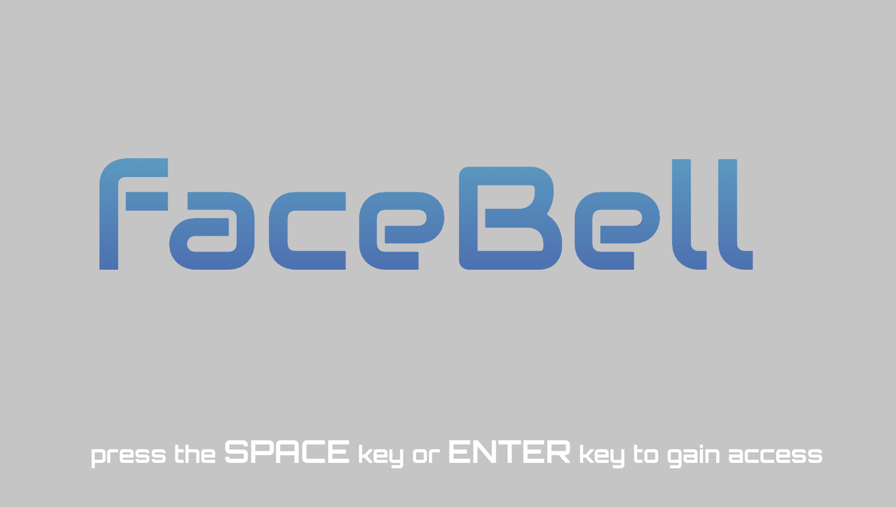

# faceBell
This is a project for a Coding Bootcamp. We are not profiting from this project.

faceBell is a web app that allows the end-user to use facial recognition to verify and authenticate a visitor. For our app, we are simulating a way for a homeowner to allow entry to their home. However, you could use this app to authenticate a user for a number of different applications by editing the code base. 

For this project we were tasked with building the app as we wanted to as long it meets the MVP features:

* As a user, I want the door to unlock automatically when it sees someone as an authorized user.

* As a user, I want to be notified via MMS text message with a photo when a non-authorized user presses my doorbell.

* As a user, I want to be able to respond to the MMS text alert stating whether or not the user is authorized.

## Prerequisites

You will need to have the following installed on your machine to be able to run our app:

* Node.js
* Express
* Nodemon

If you want to duplicate our project exactly you will need to also have a single-board microcontroller (we used an Arduino Uno) and a **motor (we used a ...).

## Getting Started

To get started you will need to fork the repository and clone into the repository on your machine. Once you have cloned the repository you will need to run `npm install` to install of the needed packages to run the app. After you hav installed the needed packages you will need to set up a .env file on your machine. The .env file will house the information for you preferred email provider. The .env file should contain the following variables:

* emailAdd
* phoneNum
* clientID
* clientSecret
* refreshToken

*Note: these are the variables needed to use the NodeMailer api as our email pass through. If you choose to use a different provider your vairables may differ. You may also hard code the information directly into your code. 

## Deployment

We have our app set to run on port 3000. If you prefer to use a different port feel free to change the port after cloning into the repository. You can use the command npm start. *Note: we are using nodemon so we do not have to start and stop the server each time we make a change. 

## Contributing

Looking to get started with Pull Request? Feel free to add a few pictures of yourself to the images folder. To do this:

1. Take 3 or 4 photos of yourself
2. Crop the photos so that the photo goes from your hairline to the bottom of your chin and from your left cheek bone to your right cheek bone. It does not have to be exact but for best results the image should be only of your face and cropped as closely as possible. 
3. save the image as a `.jpeg` file. *NOTE: The file extension `.jpg` is not accepted. 
4. Create a folder inside of the images folder and use your first name as the name of the folder. 
5. Add your cropped photos to your folder and then save. 
6. At this point, you can run it locally to see it in action. 
7. Once you have tested it you can create a pull request. 

## Authors

* **Robert Duncan** - Lead Architect
  * created base HTML and CSS
  * relayed information to our Instruction Team on progress and blockers
  * handled the DOM manipulation functions for our app

* **Ben Nguyen** - 
 * Implement face-api into app.
 * Created a function to run capture image through face-api for face recognition.
 * Created a function to use stored images as default photo for the face recognition. 

* **Ming Shiuan Tsai** - 

* **Weston Dease** - 

## License

This project is licensed under the MIT License

## Acknowledgments

* NodeMailer NPM Package
* face-api.js from **justadudewhohacks**
